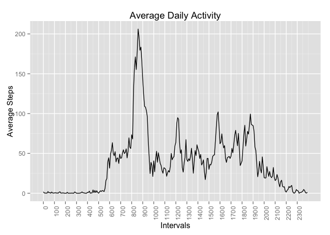
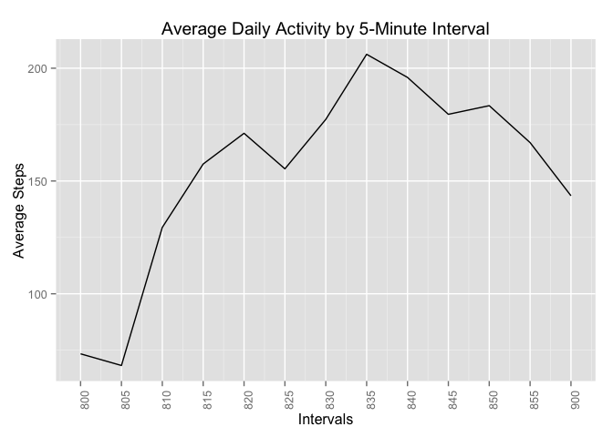
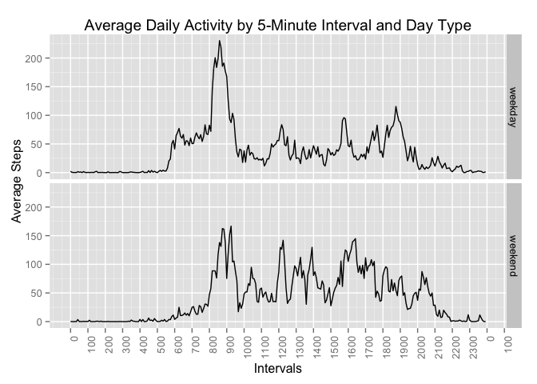

# Reproducible Research: Peer Assessment 1


## Introduction

This assignment makes use of data from a personal activity monitoring device. 
This device collects data at 5 minute intervals through out the day. The data 
consists of two months of data from an anonymous individual collected during the 
months of October and November, 2012 and include the number of steps taken in 
5 minute intervals each day.

The data for this assignment contains the following variables:

- steps: Number of steps taking in a 5-minute interval (missing values are coded as NA);
- date: The date on which the measurement was taken in YYYY-MM-DD format;
- interval: Identifier for the 5-minute interval in which measurement was taken.  
The dataset is stored in a comma-separated-value (CSV) file ("activity.csv") and there are a total of 17,568 observations in this dataset.


## Loading and preprocessing the data

The first step is to set the working directory and to load the ggplot2 library:


```r
setwd("~/Repositories/Coursera_DataScience_Spe/ReproducibleResearch/")
library(ggplot2)
```

We can now load the activity data. By default, the "date" column is loaded as 
character and the "interval" column as numeric.
As a preprocessing step, we convert the"date" column to the actual date type and 
the "interval" column to a factor:


```r
# read the file
data <- read.csv("./data/activity.csv")

# process the columns
data$date <- as.Date(data$date, format = "%Y-%m-%d")
data$interval <- as.factor(data$interval)

# display the first few rows of data
head(data)
```

```
##   steps       date interval
## 1    NA 2012-10-01        0
## 2    NA 2012-10-01        5
## 3    NA 2012-10-01       10
## 4    NA 2012-10-01       15
## 5    NA 2012-10-01       20
## 6    NA 2012-10-01       25
```


## What is mean total number of steps taken per day?

- **Histogram excluding missing values**

The data is aggregated so that we get the total count of steps per day. 
NA values are removed from that aggregation.  
We then display the aggregated data in a histogram:


```r
# sum the steps by date
agg1 <- aggregate(data$steps, by=list(data$date), FUN=sum, na.rm=TRUE)
colnames(agg1) <- c("date","steps")

# build a histogram of the aggregated data
hist(agg1$steps,breaks=10,xlab="Steps per day", ylab="Days count", main="Total Number of Steps Taken Daily (NAs removed)")
```

 

- **Mean and median**

The mean and median as shown in the below summary statistics are respectively 9,354 and 10,400 steps per days:


```r
summary(agg1$steps)
```

```
##    Min. 1st Qu.  Median    Mean 3rd Qu.    Max. 
##       0    6780   10400    9350   12800   21200
```

We notice that the mean is significantly lower than the median. This is most likely due to the missing values which pulls the average down.


## What is the average daily activity pattern?

We first compute the average number of steps taken by 5-minute interval across all days, by aggregating the data. 
NA values are removed from the aggregation:


```r
# average the data by interval
agg2 <- aggregate(data$steps, by=list(data$interval), FUN=mean, na.rm=TRUE)
colnames(agg2) <- c("interval","steps")
```

- **Time-series plot**

The graph below is a time series plot (i.e. type = "l") of the 5-minute interval (x-axis) and the average number of steps taken, averaged across all days (y-axis).  
This plot shows that the activity is at its highest between 8:30AM and 8:45AM. This could be explained not only by the morning rush hours, but also by the fact that man people like to work out n the morning before getting to work.
The other peaks of activity occur around 12:00PM, 3:45PM and 6:45PM. These times seem to coincide respectively with lunch, shool pick-up and end of day hours, which also are times that people tend to favor for working out.


```r
# sequence of indices to determine which breaks/factors to display on the plot
# a step of 12 means that the plot will show a break for every 5*12 = 60-minute interval
indices <- seq(1,length(agg2$interval), 12)

# plots the graph
ggplot(data=agg2, aes(x=as.numeric(agg2$interval), y=agg2$steps)) +
    geom_line() +
    xlab("Intervals") +
    ylab("Average Steps") +
    ggtitle("Average Daily Activity") +
    theme(axis.text.x = element_text(angle = 90, hjust = 1)) +
    scale_x_continuous(breaks=indices, labels=agg2$interval[indices])
```

 

- **Maximum number of steps in 5-minute interval**

By zooming into the range 8:00AM-9:00AM, we see that the average maximum number of steps across all the days occurs at the 8:35AM interval.
To zoom on the range of interest, we subset the previous aggregation to only include the data for the range [800:900].
We can then plot this subset to visualize the maximum point:


```r
# create a subset of the aggregated data frame to contain only the intervals between 8 and 9AM included
subagg2 <- agg2[as.numeric(as.character(agg2$interval)) >= 800 & as.numeric(as.character(agg2$interval)) <= 900,]

# sequence of indices with a step of 1 (default)
indices <- seq(1,length(subagg2$interval))

# plots the graph
ggplot(data=subagg2, aes(x=indices, y=subagg2$steps)) +
    geom_line() +
    xlab("Intervals") +
    ylab("Average Steps") +
    ggtitle("Average Daily Activity by 5-Minute Interval") +
    theme(axis.text.x = element_text(angle = 90, hjust = 1)) +
    scale_x_continuous(breaks=indices, labels=subagg2$interval[indices])
```

 


## Imputing missing values

- **Number of missing values**

The data set contains 2,304 missing values in the "steps" column. This can be computed simply by taking the length of the vector containing the records where is.na() on the "steps" value returns True.


```r
length(data$steps[is.na(data$steps)])
```

```
## [1] 2304
```

- **Missing values strategy**

The strategy adopted to fill in missing values is to use the average count of steps taken for each interval. 
For example, if the 10:00AM interval for a given day is NA and the mean count of steps for the 10:00AM interval is 20 steps, 
we will replace the missing value NA with 20 for that slot (and for every other 10:00AM slot missing a value).

- **Fill in missing values**

Using the strategy described above, we can fill in the missing values into a 
new data frame using a for loop:


```r
# copy the data in new data frame and loop over rows to fill in missing values
data.filled <- data
for(i in agg2$interval)
{
    data.filled[is.na(data.filled$steps) & data.filled$interval == i, "steps"] <- 
        agg2[agg2$interval == i, "steps"]
}

# display the first few rows of data
head(data.filled)
```

```
##     steps       date interval
## 1 1.71698 2012-10-01        0
## 2 0.33962 2012-10-01        5
## 3 0.13208 2012-10-01       10
## 4 0.15094 2012-10-01       15
## 5 0.07547 2012-10-01       20
## 6 2.09434 2012-10-01       25
```

We can now see that the first few rows of the new data frame do not contain any NA value.

- **Histogram including missing values**

The below histogram represents the total number of steps taken each day, where NA values have been filled in using the strategy described peviously.
As can be seen on this graph, we see a significant increase in the number of days with over 10,000 steps per day. Those counts have been shifted from the left position in the original histogram (excluding missing values) to the central position of the current histogram.


```r
# sum the data by date
agg3 <- aggregate(data.filled$steps, by=list(data.filled$date), FUN=sum, na.rm=TRUE)
colnames(agg3) <- c("date","steps")

# build a histogram of the aggregated data
hist(agg3$steps,breaks=10,xlab="Steps per day", ylab="Days count", main="Total Number of Steps Taken Daily (NAs replaced)")
```

 

```r
# display statistics
summary(agg3$steps)
```

```
##    Min. 1st Qu.  Median    Mean 3rd Qu.    Max. 
##      41    9820   10800   10800   12800   21200
```


## Are there differences in activity patterns between weekdays and weekends?

First we define a function 'day.func' which takes a date as a parameter and returns 'weekend' as a factor if the day for that date is Saturday or Sunday, or returns 'weekday' as a factor otherwise.
We can then apply this function to our data frame where missing values have been filled in and save the results into a new column in our data frame name "daytype".


```r
# create function mapping a date to a day type
day.func <- function(d) {
    if(weekdays(d) %in% c("Saturday","Sunday")) {
        return(as.factor("weekend"))
    } else {
        return(as.factor("weekday"))
    }
}

# add column to the data frame with day type
data.filled$daytype<-sapply(data.filled$date,FUN=day.func)
```

Finally, we can aggregate the data by 5-minute interval and day type and then plot the results into a time-series graph. Each day type is plotted into its own graph using facets.


```r
# average the steps by interval and day type
agg4 <- aggregate(data.filled$steps, by=list(data.filled$interval, data.filled$daytype), FUN=mean, na.rm=TRUE)
colnames(agg4) <- c("interval","daytype","steps")

# plot the aggregation results into 2 graphs (1 per day type)
indices <- seq(1,length(agg4$interval), 12)
ggplot(data=agg4, aes(x=as.numeric(agg4$interval), y=agg4$steps)) +
    geom_line() +
    xlab("Intervals") +
    ylab("Average Steps") +
    ggtitle("Average Daily Activity by 5-Minute Interval and Day Type") +
    theme(axis.text.x = element_text(angle = 90, hjust = 1)) +
    scale_x_continuous(breaks=indices, labels=agg4$interval[indices]) +
    facet_grid(daytype ~ .)
```

 

The plots above show that while the the activity is more important on weekdays during the early hours (between 8:00AM and 9:30AM), there's more activity registered throughout the day on weekends than on weekdays. The plot on weekends show less clear difference between the different time intervals.

