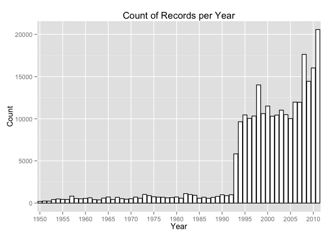
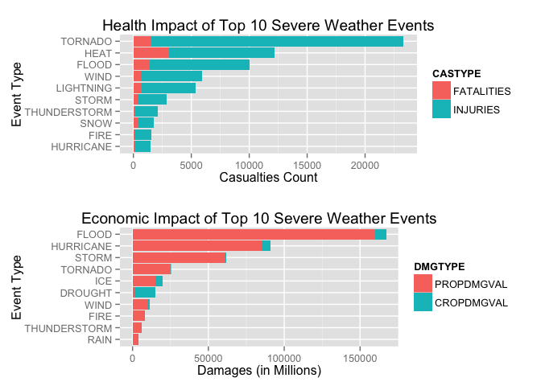
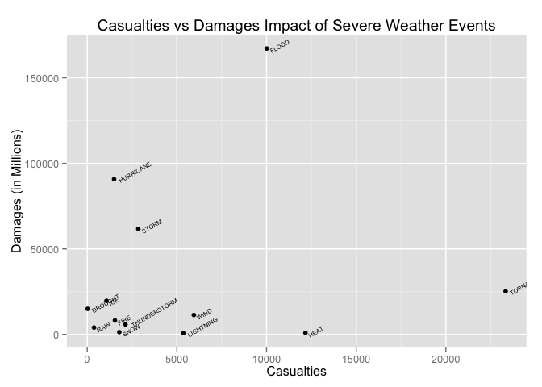

# Reproducible Research: Peer Assessment 2


#Severe Weather Events Impact on Health and Economy

###Synopsis

Storms and other severe weather events can cause both public health and economic problems for communities and municipalities. Many severe events can result in fatalities, injuries, and property damage, and preventing such outcomes to the extent possible is a key concern.

In this project, we explore the U.S. National Oceanic and Atmospheric Administration's (NOAA) storm database, which tracks characteristics of major storms and weather events in the United States, including when and where they occur, as well as estimates of any fatalities, injuries, and property damage.

Using this data, we identify which top 10 severe weather events are the most harmful health-wise and the events that have the greatest economic impacts. As shown in this analysis and summarized in the conclusion of this document, we find that tornadoes, excessive heat and floods are the most dangerous for the population, while floods, hurricanes and storms cause the most damages on the economy.


###Data Processing

First we load the required R libraries:


```r
library(R.utils)
library(reshape2)
library(ggplot2)
library(gridExtra)
```

```
## Loading required package: grid
```

We then load the data from the internet (http://d396qusza40orc.cloudfront.net/repdata%2Fdata%2FStormData.csv.bz2).


```r
setwd("~/Repositories/Coursera_DataScience_Spe/ReproducibleResearch/")

if (!"stormData.csv" %in% dir("./data/")) {
    download.file("http://d396qusza40orc.cloudfront.net/repdata%2Fdata%2FStormData.csv.bz2", destfile = "data/stormData.csv.bz2")
    bunzip2("data/stormData.csv.bz2", overwrite=T, remove=F)
}

storm <- read.csv("./data/stormData.csv")
```

We are only interested in the records that have at least one health (fatality or injury) or economic (property or crop damage) impact:


```r
# keep only data that has health or economic impact and only the requred columns
storm <- subset(storm, FATALITIES + INJURIES + PROPDMG + CROPDMG > 0, select=c(BGN_DATE, EVTYPE, FATALITIES:CROPDMGEXP))
```

The events in the database span from 1950 to 2011. The earlier years however are most likely less reliable due to a lack of good records. More recent years should be considered more complete. Therefore, in this analysis we focus on the years 1995 to 2011, as the below histogram shows a better recording starting around 1995:


```r
# define the rows to keep as the rows with a begin date in 1995 or later
storm$YEAR <- format(as.Date(storm$BGN_DATE, format = "%m/%d/%Y %H:%M"),"%Y")

xaxis <- as.factor(seq(1950,2011,5))
ggplot(storm, aes(x=as.factor(YEAR))) +
    geom_histogram(color="black", fill="white") +
    scale_x_discrete(breaks=xaxis, labels=xaxis) +
    xlab("Year") +
    ylab("Count") +
    ggtitle("Count of Records per Year")
```

 

```r
storm <- storm[as.numeric(storm$YEAR) >= 1995, ]
```

All damage values must be converted to use the same scale, so that they can be summed up. All amounts are expressed in millions of dollars.  

**Note:** in this analysis, we ignore the effect of inflation on real property and crop damage values. In other words we consider that $1 in 1995 is the same as $1 in 2011 (even though in reality this is untrue and we would need to adjust those values for inflation prior to summing them).


```r
# use upper case for all exponents
storm$PROPDMGEXP <- toupper(storm$PROPDMGEXP)
storm$CROPDMGEXP <- toupper(storm$CROPDMGEXP)

# define a function taking the abbreviated version of the damage value and the corresponding exponent
# and returns the actual value of the damages in millions
calc.val <- function(dmg, exp) {
  e <- 0

  if (exp == "H")  e <- 2
  else if (exp == "K")  e <- 3
  else if (exp == "M") e <- 6
  else if (exp == "B") e <- 9

  val <- dmg * 10**e
  return(val / 1000000)
}

# apply the function on property and crop damages and exponents
# and store the results as new columns in the data frame
storm$PROPDMGVAL <- mapply(calc.val, storm$PROPDMG, storm$PROPDMGEXP)
storm$CROPDMGVAL <- mapply(calc.val, storm$CROPDMG, storm$CROPDMGEXP)
```

We set a naming convention for event types, as a lot of records contain different wordings for the same event type:


```r
storm$EVTYPE <- toupper(storm$EVTYPE)

get.event <- function(evt) {
    ret = evt
    
    if (any(grepl("TORNADO", evt))) ret = "TORNADO" 
    else if (any(grepl("THUNDERSTORM", evt))) ret = "THUNDERSTORM" 
    else if (any(grepl("TYPHOON|HURRICANE|M HURRICANE|FLOYD|WATERSPOUT", evt))) ret = "HURRICANE" 
    else if (any(grepl("PRECIPITATION|RAIN|SHOWER", evt))) ret = "RAIN" 
    else if (any(grepl("DROUGHT", evt))) ret = "DROUGHT" 
    else if (any(grepl("COLD", evt))) ret = "COLD" 
    else if (any(grepl("STORM", evt))) ret = "STORM" 
    else if (any(grepl("FIRE", evt))) ret = "FIRE" 
    else if (any(grepl("FLOOD|FLD", evt))) ret = "FLOOD" 
    else if (any(grepl("HEAT|TEMPERATURE", evt))) ret = "HEAT" 
    else if (any(grepl("ICE|FREEZE|SLEET|HAIL", evt))) ret = "ICE" 
    else if (any(grepl("LIGHTING", evt))) ret = "LIGHTING" 
    else if (any(grepl("SNOW|BLIZZARD|AVALANCHE", evt))) ret = "SNOW" 
    else if (any(grepl("SURF|SURGE|TIDAL|TIDE|SWELLS", evt))) ret = "SURGE" 
    else if (any(grepl("VOLCAN", evt))) ret = "VOLCANO" 
    else if (any(grepl("WIND", evt))) ret = "WIND" 
    else if (any(grepl("CURRENT", evt))) ret = "CURRENT" 
    else if (any(grepl("WINTER", evt))) ret = "WINTER WEATHER" 
    else if (any(grepl("FOG", evt))) ret = "FOG"
    
    return(ret)
}

storm$EVENT <- mapply(get.event, storm$EVTYPE)
```


###Results

####1. Across the United States, which types of events are most harmful with respect to population health?

We find the top 10 weather events that had the most combined count of fatalities and injuries:


```r
# find the top 10 events with health impact (i.e. most casualties)
data1 <- aggregate(cbind(FATALITIES,INJURIES,FATALITIES+INJURIES) ~ EVENT, FUN=sum, data=storm)
colnames(data1) <- c("EVENT","FATALITIES","INJURIES","TOTAL")
hltTop10 <- tail(data1[order(data1$TOTAL),"EVENT"], n=10)

# only keep data for those top 10 events
casualties <- data1[data1$EVENT %in% hltTop10,]
casualties$EVENT <- factor(casualties$EVENT, levels=hltTop10)
casualties <- casualties[order(-casualties$TOTAL),] # sort by total
rownames(casualties) <- NULL # to start numbering of rows at 1
casualties
```

```
##           EVENT FATALITIES INJURIES TOTAL
## 1       TORNADO       1545    21787 23332
## 2          HEAT       3081     9088 12169
## 3         FLOOD       1413     8598 10011
## 4          WIND        672     5273  5945
## 5     LIGHTNING        729     4631  5360
## 6         STORM        376     2472  2848
## 7  THUNDERSTORM        182     1950  2132
## 8          SNOW        422     1367  1789
## 9          FIRE         87     1458  1545
## 10    HURRICANE        137     1361  1498
```

The types of events above are the most harmful with respect to population health.

####2. Across the United States, which types of events have the greatest economic consequences?

We find the top 10 weather events that had the most combined value of property and crop damages:


```r
# find the top 10 events with health impact (i.e. most casualties)
data2 <- aggregate(cbind(PROPDMGVAL,CROPDMGVAL,PROPDMGVAL+CROPDMGVAL) ~ EVENT, FUN=sum, data=storm)
colnames(data2) <- c("EVENT","PROPDMGVAL","CROPDMGVAL","TOTAL")
ecoTop10 <- tail(data2[order(data2$TOTAL),"EVENT"], n=10)

# only keep the data for top 10 events
damages <- data2[data2$EVENT %in% ecoTop10,]
damages$EVENT <- factor(damages$EVENT, levels=ecoTop10)
damages <- damages[order(-damages$TOTAL),] # sort by total
rownames(damages) <- NULL # to start numbering of rows at 1
damages
```

```
##           EVENT PROPDMGVAL CROPDMGVAL  TOTAL
## 1         FLOOD     160199     6927.8 167127
## 2     HURRICANE      85256     5515.6  90772
## 3         STORM      60982      730.4  61712
## 4       TORNADO      24931      296.6  25227
## 5           ICE      15114     4538.8  19653
## 6       DROUGHT       1046    13922.1  14968
## 7          WIND      10029     1304.6  11334
## 8          FIRE       7766      402.3   8168
## 9  THUNDERSTORM       5321      521.9   5843
## 10         RAIN       3179      853.0   4032
```

The types of events above have the greatest economic consequences.

####3. Summary

The below bar plots illustrates the above findings:


```r
# get casualties count for those 10 events
melt1 <- melt(casualties, id.vars = "EVENT", measure.vars= c("FATALITIES","INJURIES"))
colnames(melt1) <- c("EVENT","CASTYPE","COUNT")

# plot results
casplot <- ggplot(melt1, aes(x=EVENT, y=COUNT, fill=CASTYPE)) + 
  geom_bar(stat="identity") +
  coord_flip() +
  xlab("Event Type") +
  ylab("Casualties Count") +
  ggtitle("Health Impact of Top 10 Severe Weather Events")

# get damages total for those 10 events
melt2 <- melt(damages, id.vars = "EVENT", measure.vars= c("PROPDMGVAL","CROPDMGVAL"))
colnames(melt2) <- c("EVENT","DMGTYPE","SUM")

# plot results
ecoplot <- ggplot(melt2, aes(x=EVENT, y=SUM, fill=DMGTYPE)) + 
  geom_bar(stat="identity") +
  coord_flip() +
  xlab("Event Type") +
  ylab("Damages (in Millions)") +
  ggtitle("Economic Impact of Top 10 Severe Weather Events")

# display in a grid
grid.arrange(casplot, ecoplot, nrow = 2)
```

 

Furthermore, the below graph shows the count of casualties against the value of damages for the union of top 10 events that had the most health and economic impacts:


```r
data3 <- subset(storm, EVENT %in% c(hltTop10, ecoTop10), select=c(EVENT, FATALITIES, INJURIES, PROPDMGVAL, CROPDMGVAL))
aggAll <- aggregate(cbind(FATALITIES+INJURIES, PROPDMGVAL+CROPDMGVAL) ~ EVENT, FUN=sum, data=data3)
colnames(aggAll) <- c("EVENT","CASUALTIES","DAMAGES")
aggAll
```

```
##           EVENT CASUALTIES  DAMAGES
## 1       DROUGHT         25  14968.4
## 2          FIRE       1545   8168.3
## 3         FLOOD      10011 167127.1
## 4          HEAT      12169    919.4
## 5     HURRICANE       1498  90771.8
## 6           ICE       1074  19653.2
## 7     LIGHTNING       5360    798.0
## 8          RAIN        378   4031.7
## 9          SNOW       1789   1370.9
## 10        STORM       2848  61712.3
## 11 THUNDERSTORM       2132   5842.7
## 12      TORNADO      23332  25227.2
## 13         WIND       5945  11333.6
```

```r
ggplot(aggAll, aes(x=CASUALTIES, y=DAMAGES, label=EVENT)) +
  geom_point() +
  geom_text(size=2, vjust=1.5, hjust=-0.1, angle=30) +
  xlab("Casualties") +
  ylab("Damages (in Millions)") +
  ggtitle("Casualties vs Damages Impact of Severe Weather Events")
```

 

###Conclusion

The analysis shows that the top 3 most harmful events in terms of population's health are tornadoes, excessive heat and floods. Similarly, we see tht floods, hurricanes and storms have the most imact on the economy. Based on those results, it seems that floods are the most dangerous events with regards to both health and economy (tornadoes are a closed second as they are #4 in terms of economic impacts).


